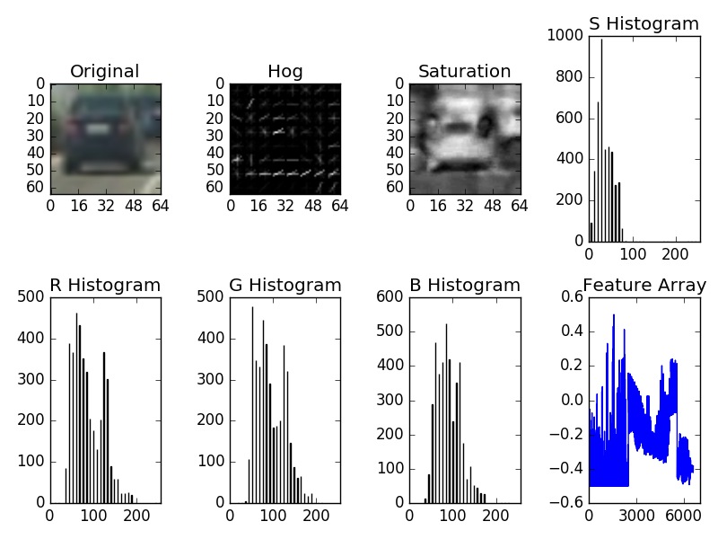
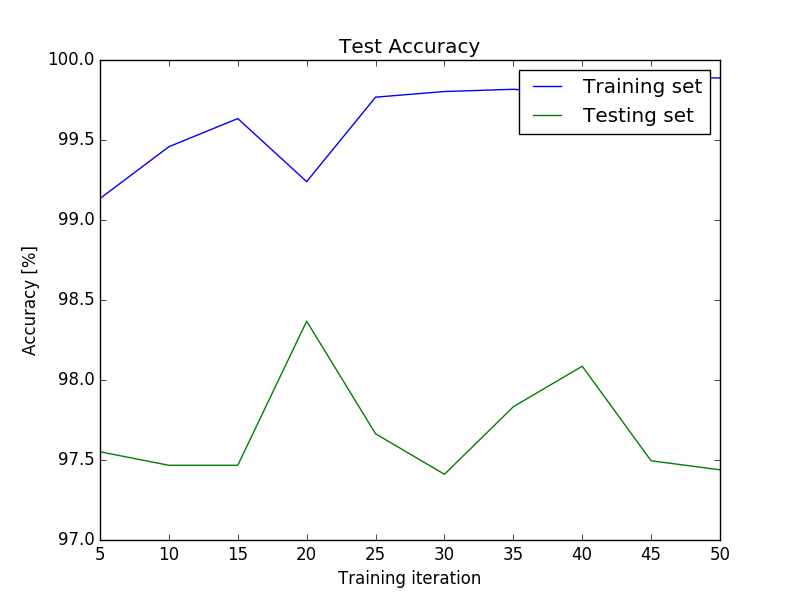

# Vehicle Detection and Tracking #
The objective of this project is to develop a pipeline that takes a picture of a roadway and identifies the vehicles that are present therein.  In order to reduce the occurrence rate of false positives, information is kept between sequential images.  Single identifications are generally false positives, as vehicles do not appear and disappear within a single frame of video.

### A Note About Setup ###
In order to run this pipeline, one must either have 

1. A pair of subdirectories ('/vehicles' and '/non-vehicles') containing 64x64 pixel color PNG images on which to train

2. Saved numpy datafiles: X_train.npy, X_test.npy, y_train.npy, y_test.npy

If `load_data = True` the pipeline will take option 2, and load the numpy data.  If `load_data == False` the pipeline will take option 1, and save the numpy files to save time later.  Neither of these datasets are small enough to upload to this repository.  For myself, I used the [Vehicle Data](https://s3.amazonaws.com/udacity-sdc/Vehicle_Tracking/vehicles.zip) and [Non-Vehicle Data](https://s3.amazonaws.com/udacity-sdc/Vehicle_Tracking/non-vehicles.zip) links provided by Udacity.

## Feature Creation ##
Using the provided image set, there are 8792 images of vehicles (label = 1), and 8968 images of non-vehicles (label = 0).

In order to create a feature array for each image, I augmented data arrays of the following: HOG vector (8x8 pixels, 2x2 cells, 12 orientations), RGB red histogram (32 bins), RGB green histogram (32 bins), RGB blue histogram (32 bins), HLS saturation histogram (32 bins), RGB red spatial data (resized 32x32), RGB green spatial data (resized 32x32), RGB blue spatial data (resized 32x32) and HLS spatial data (resized 32x32).  This results in each 64x64 pixel input image having 6576 features (7\*7\*2\*2\*12+32\*4 + 1024\*4).  I applied manual normalization so that each element is scaled in the range [-0.5,0.5].

The code below shows how feature extraction is done for a 64x64x3 image.

```python
#---------------------------------#
### Get feature vector function ###
#---------------------------------#

def get_feature(img, spatial_size = (32, 32), hist_width = 4, n_bins = 32, orient = 12, pix = 8, cells = 2):
    # take in an RGB image
    # extract color histograms
    # extract spatial color data
    # extract hog data
    # concatenate

    # metadata
    height = img.shape[0]

    # feature maximum value for normalizing
    feat_max = np.float32(img.shape[0]*img.shape[1])

    # hog data
    img_gray = cv2.cvtColor(img, cv2.COLOR_RGB2GRAY)
    hog_array = hog(img_gray, orientations=orient, pixels_per_cell=(pix, pix),
                    cells_per_block=(cells, cells), visualise=False, feature_vector=True)
    hog_array = feat_max*hog_array/max(hog_array)

    # color histograms
    img_hsv = cv2.cvtColor(img, cv2.COLOR_RGB2HSV)

    # color histograms
    img_S = cv2.cvtColor(img, cv2.COLOR_RGB2HSV)[:,:,1]
    rhist = np.histogram(img[:,:,0], bins=n_bins, range=(0, 256))
    ghist = np.histogram(img[:,:,1], bins=n_bins, range=(0, 256))
    bhist = np.histogram(img[:,:,2], bins=n_bins, range=(0, 256))
    shist = np.histogram(img_S[:,:], bins=n_bins, range=(0, 256))

    # spatial color data
    small_rgb = cv2.resize(img, (spatial_size[0], spatial_size[1]))
    spatial_rgb = np.array(small_rgb.ravel(),dtype = np.float)
    spatial_rgb *= feat_max / 255.0
    small_s = cv2.resize(img_S, (spatial_size[0], spatial_size[1]))
    spatial_s = np.array(small_s.ravel(),dtype = np.float)
    spatial_s *= feat_max / 255.0

    # concatenate and normalize data
    feature = np.concatenate((hog_array, rhist[0], ghist[0], bhist[0], shist[0], spatial_rgb, spatial_s))/feat_max
    feature = feature.astype(np.float)-0.5

    return feature
 ```
 
The image below shows an example image, its tranformations, and the resulting feature vector.


*Example image data features*

### HOG Parameter Optimization ###
In order to tune the `hog()` function parameters, I used a straightforward technique.  I removed all other features, so that only HOG data was used to train the classifier.  I then tuned the parameters in a random-walk type of manual process.  If the test accuracy of the classifier improved, I kept the change, if it worsened, I reversed the change.  I did this for several iterations until there was a diminishing return in terms of test accuracy.
 
## Training and Validation ##
I used a LinearSVM to train my classifier.  The image below shows the test accuracy and training accuracy versus the number of training iterations.  Since overfitting appears to become an issue after around 20 iterations, that is what I chose for my final fit.


*Training and validation error versus number of iterations*

I made two errors when it came to creating training and validation datasets.  Initially I used train_test_split() to create my training and validation datasets.  This resulted in very high training and validation accuracies, but very poor performance on test images.  This implied the model was overfit.  Reviewing comments from the Confluence message boards, there is a very good point raised on this topic.  Essentially, train_test_split() integrates a shuffling step of the data.  Since the data is a set of images that are temporally very similar, shuffling these images puts nearly identical samples in the training and validation sets.  This results in extreme overfitting.

So, to overcome this issue, I implemented a blunt training/validation data split: keep the images in order and just take the last 20% for my test data.  This was a very effective suggestion by both [Mikel](https://carnd-forums.udacity.com/questions/users?username=anokas) and [Gilad](https://carnd-forums.udacity.com/questions/users?username=giladgressel).  In this way, very similar images are kept together as either training or testing information, but don't cross over.  However, my first implementation of this split resulted in 100% of the validation data being "non-vehicle".  Below is my original implementation, second implementation, and final implementation.

```python
# Original data split technique
X_train, X_test, y_train, y_test = train_test_split(features,
                                                    labels,
                                                    test_size = 0.2,
                                                    random_state = 0)

# Second data split technique (validation data biased to non-vehicle)
X_train = features[0:14208]
X_test = features[14208:17760]
y_train = labels[0:14208]
y_test = labels[14208:17760]

# Final data split technique (training and validation sets evenly biased)
# create an array of feature filenames
X_train_veh_filenames = vehlist[0:int(num_veh_imgs*0.8)]
X_test_veh_filenames = vehlist[int(num_veh_imgs*0.8):num_veh_imgs]
X_train_nveh_filenames = nvehlist[0:int(num_nveh_imgs*0.8)]
X_test_nveh_filenames = nvehlist[int(num_nveh_imgs*0.8):num_nveh_imgs]
X_train_filenames = X_train_veh_filenames + X_train_nveh_filenames
X_test_filenames = X_test_veh_filenames + X_test_nveh_filenames

# create an array of labels
y_train = np.append(np.ones((len(train_veh_filenames),1),dtype = np.uint8),
                   np.zeros((len(train_nveh_filenames),1), dtype = np.uint8))
y_test = np.append(np.ones((len(test_veh_filenames),1),dtype = np.uint8),
                   np.zeros((len(test_nveh_filenames),1), dtype = np.uint8))
                   
X_train = np.zeros((num_train,feat_L), dtype = np.float)
X_test = np.zeros((num_test,feat_L), dtype = np.float)
for idx in range(num_train):
    fname = X_train_filenames[idx]
    img = get_image(fname)
    feat = get_feature(img)
    assert len(feat) == feat_L, 'length of feature is wrong!'
    X_train[idx] = feat

for idx in range(num_test):
    fname = X_test_filenames[idx]
    img = get_image(fname)
    feat = get_feature(img)
    assert len(feat) == feat_L, 'length of feature is wrong!'
    X_test[idx] = feat
```

## Scanning a Single Frame ##

In order to create a function to scan a frame of video, I created `class BBox()`.  Within this class are methods to update the box location within an image.

```python
#----------------------------#
### Class for bounding box ###
#----------------------------#

class BBox():
    # Bounding box to search in an image
    def __init__(self, size, stride, origin, stop):
        # coordinates of the upper left corner to start search
        self.origin = origin
        self.origindeep = origin #never lose the original origin
        # width and height
        self.size = size
        # horizontal and vertical stride for scanning
        self.stride = stride
        # coordinates of the upper left corner of the box
        self.start = self.origin
        # y coordinate above which to scan
        self.stop = stop
        # flag to keep track of box within boundary
        self.out_of_bounds = 0

    def new_origin(self, origin):
        # update the origin of the box
        self.origin = origin
        self.start = origin

    def end(self):
        # update the end (lower-right corner) of the box
        x = self.start[0]+self.size[0]
        y = self.start[1]+self.size[1]
        return (x, y)

    def walk_right(self):
        # move the box in the x direction
        x = self.start[0] + self.stride[0]
        y = self.start[1]
        self.start = (x, y)
        self.end()

    def walk_down(self):
        # move the box in the y direction, reset x
        x = 0
        y = self.start[1] + self.stride[1]
        self.start = (x, y)
        self.end()

    def __str__(self):
        return "Start = %s, End = %s" % (self.start, self.end())

    def reset(self):
        # set the origin back to its original place
        self.origin = self.origindeep
        self.start = self.origin
```

Then I created a list of `BBox()` instances that I could use to iterate over a single frame.  For all bounding boxes, I began searching at y-coordinate 350.  There will not be any vehicles above this point, as it corresponds to the sky in the images.  For the smallest bounding box, I stopped the search at y-coordinate 550.  Vehicles that are below that coordinate will be close to the camera, and appear much larger than 96x96 pixels.  For the larger images, I stopped the search at y-coordinate 680 (near the hood).

```python
box1 = BBox(size = (196,196), stride = (32, 32), origin = (0,350), stop = 680)
box2 = BBox(size = (128,128), stride = (24, 24), origin = (0,350), stop = 680)
box3 = BBox(size = (96,96), stride = (16, 16), origin = (0,350), stop = 550)

boxes = [box1, box2, box3]
```

The resulting scan areas can be seen in the [boxscan.mp4 video](output_images/boxscan.mp4) below.  I chose this frame for my test since it has two cars present.

[](https://youtu.be/SUZjjl_zIs4)
*Scanning a single frame for vehicles*

## Heat Mapping ##
In order to identify and track vehicles within the video, I created `class HeatMap()`, which creates a black image, with bright red spots where there are many bounding boxes identified.  The method `def cool(self)` is used to track the hot spots across multiple frames.  This is beneficial for building confidence in areas that are identified in many consecutive frames, and ignoring temporary false positives.

```python
class HeatMap():
    #blank images
    def __init__(self, image):
        self.img = np.zeros_like(image)
        self.cool_rate = 25
        self.threshold = 0

    def addheat(self, boxlist):
        # heat up (brighten) areas that have bounding boxes 
        for idx in range(len(boxlist.list)):
            x1 = boxlist.list[idx][0]
            y1 = boxlist.list[idx][1]
            x2 = boxlist.list[idx][2]
            y2 = boxlist.list[idx][3]
            for x in range(x1, x2):
                for y in range(y1, y2):
                    # don't allow overflow or bright areas turn
                    # black inadvertently
                    if self.img[y, x, 0] < 245:
                        self.img[y, x, 0] += 10
                    
    def cool(self):
        # cool down areas after each frame to remove false positives
        self.img[self.img < self.cool_rate] = 0
        self.img[self.img >= self.cool_rate] -= self.cool_rate

    def thresh(self):
        # throw out areas that aren't hot (bright) enough
        img = self.img
        img[img <= self.threshold] = 0

        return img

    def reset(self):
        self.img = 0
```
A simple thresholding, in conjuction with the `cool()` method above, is able to resolve the false positives.  So, there are two key parameters that need to be tuned in order to implement robust heat mapping.

1. cool_rate - how much heat is removed after each frame

2. threshold - the amount of accumulated heat necessary to positively identify a region as a vehicle

The [heatmap_video_out.mp4 video](output_images/heatmap_video_out.mp4) below shows how my heat mapping algorithm performs on the project video, with `threshold = 0`.  It's clear that there a few false positives but that, in general, the performance is good.  A final `threshold = 30` was used for the final solution.

[](https://youtu.be/AdDrUNGaqvE)
*Heat map results over project video*

## Final Identification ##
Even following the heat mapping and thresholding, my final video still had some very small blips visible.  To overcome these, I put a sort-of dimensionality check on the final bounding regions.  If there are very small hotspots, they are not vehicles.

```python
labels = label(image_thresh)

for box_label in range(labels[1]):
    pixels = (labels[0] == (box_label+1)).nonzero()
    x1 = np.min(np.array(pixels[1]))
    x2 = np.max(np.array(pixels[1]))
    y1 = np.min(np.array(pixels[0]))
    y2 = np.max(np.array(pixels[0]))
    
    # filter out very small bounding regions
    if (y2-y1) > 50 and (x2-x1)> 50:
        cv2.rectangle(image, (x1, y1), (x2, y2), (255,255,0), 6)
```

With this in place, my result is the [project_video_out.mp4 video](project_video_out.mp4) here.  One issue that I was not able to resolve is that the white car is seemingly lost as it traverses the bright colored pavement.  This may be due to insufficient training data for the classifier.

[]()
*Final output video with vehicles found*

## Reflections ##
The single biggest shortcoming with this pipeline, in my opinion, is the speed.  It takes approximately 50 minutes to process a 50 second video, so it needs to be 60 to 100 times faster.  I didn't extract all HOG data upfront, as this suggestion was posted to the lesson after my code design was underway, and it was not well structured to handle this change.  It would be an extensive tear-up to make the code compatible with this approach.

Additional time could be saved by not running `cv2` processing functions on full images.  Even though the box scan only takes place on the lower region of the camera images, many image transformations still run on the complete image.  This could be a simple way to speed up the pipeline.

In the end it is not clear to me why these methods (HOG, histogram, SVM, etc) were introduced after convolutional neural networks.  My intuition is that using a CNN was the classifier here would give much better results.  Based on experience in other projects, a well-constructed CNN will not identify a blank road or barrier as a vehicle.

There are some additional aspects of vehicle tracking that would be interesting to explore.  This pipeline only locates a vehicle in a 2D plane.  What is more interesting to an automated vehicle is the relative position and velocity of these vehicles.  For instance, a vehicle that is approaching in the vehicle's current lane is much more interesting than a vehicle that is leaving and in a different lane.
